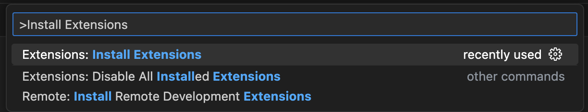
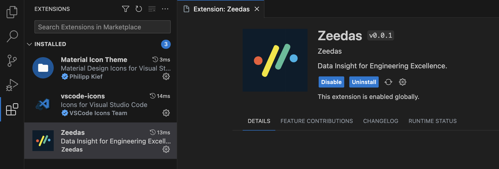

# Zeedas for Visual Studio Code

[Zeedas][zeedas] - Data Insight for Engineering Excellence.

## Installation

1. Press `F1` or `⌘ + Shift + P` and type `install`. Pick `Extensions: Install Extension`.

    
2. Type `zeedas` and hit `enter`.

    

3. Enter your [api key][api key], then press `enter`.

    > (If you’re not prompted, press `F1` or `⌘ + Shift + P` then type `Zeedas API Key`.)

## Configuring

VS Code specific settings are available from `⌘ + Shift + P`, then typing `zeedas`.

For example, to hide today's coding activity in your status bar:

Press `⌘ + Shift + P` then set `Zeedas: Status Bar Coding Activity` to `false`.

## Troubleshooting

First, turn on debug mode:

1. Press `F1` or `⌘ + Shift + P`
2. Type `> Zeedas: Debug`, and press `Enter`.
3. Select `true`, then press `Enter`.

Next, open your Developer Console to view logs and errors:

## Uninstalling

1. Click the Extensions sidebar item in VS Code.

2. Type `zeedas` and hit enter.

3. Click the settings icon next to Zeedas, then click Uninstall.

## Contributing

Many thanks to all [contributors](AUTHORS)!

Made with :heart: by the [Zeedas Team][about].

[zeedas]: https://zeedas.com
[issues]: https://github.com/zeedas/vscode/issues
[about]: https://zeedas.com
